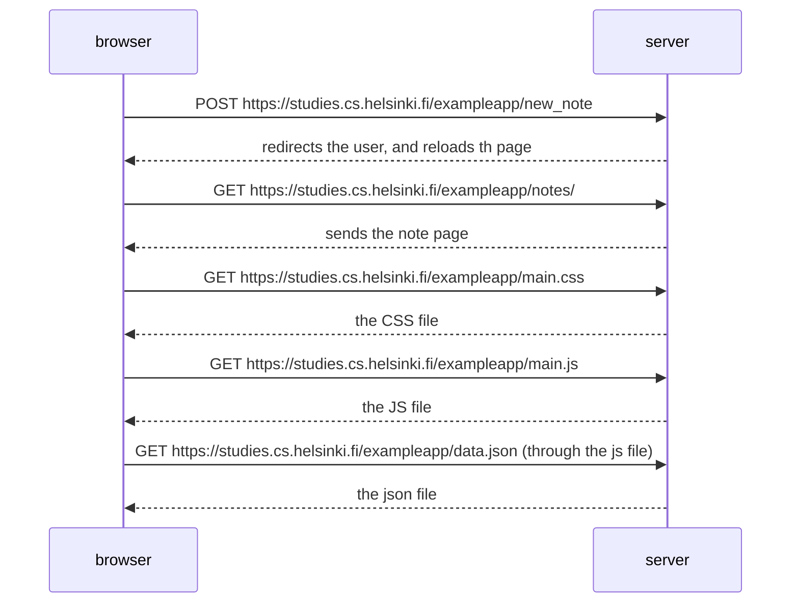

```mermaid 
sequenceDiagram
    participant browser
    participant server
    browser ->> server: POST https://studies.cs.helsinki.fi/exampleapp/new_note
    server -->> browser: redirects the user, and reloads th page
    browser ->> server: GET https://studies.cs.helsinki.fi/exampleapp/notes/
    server -->> browser: sends the note page
    browser ->> server: GET https://studies.cs.helsinki.fi/exampleapp/main.css
    server -->> browser: the CSS file
    browser ->> server: GET https://studies.cs.helsinki.fi/exampleapp/main.js
    server -->> browser: the JS file
    browser ->> server: GET https://studies.cs.helsinki.fi/exampleapp/data.json (through the js file)
    server -->> browser: the json file
```